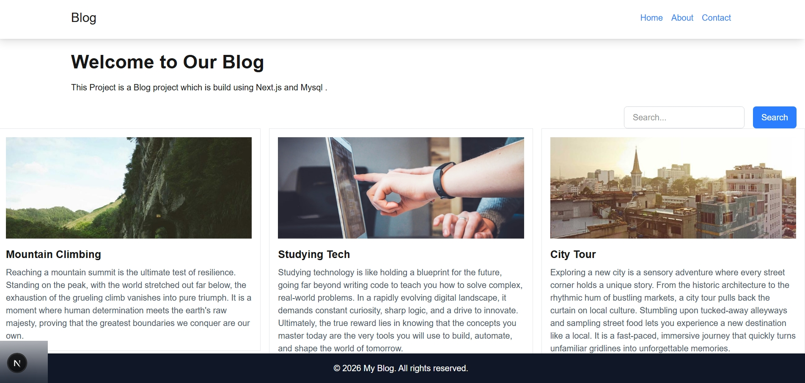
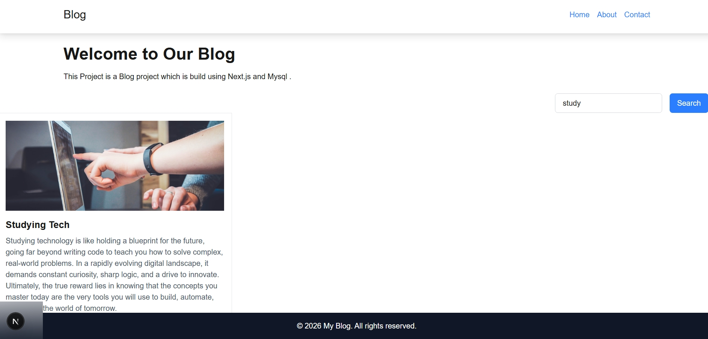
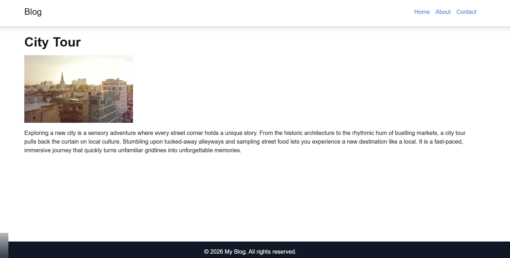
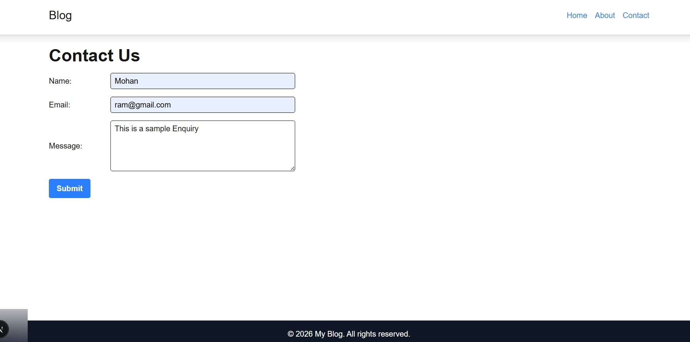

# 📝 Blog Management System

A full-stack blog application built with **Next.js** and **MySQL** that allows users to browse blog posts, search articles, view detailed posts, and send enquiries through a contact form.

---

## ✨ Features

- 📰 View all blog posts
- 🔍 Search blog posts by title and content
- 📄 View individual blog details
- 📬 Contact form with MySQL database
- 📱 Responsive UI using Tailwind CSS

---

## 🛠️ Technologies Used

- Next.js
- React.js
- JavaScript
- MySQL
- Tailwind CSS
- REST API
- Git
- GitHub

---

## 📷 Screenshots

### 🏠 Home Page



### 🔍 Search Functionality



### 📄 Blog Details



### 📬 Contact Page



---

## 🚀 Installation

```bash
git clone https://github.com/Jebarshan-J/Blog_Project.git

cd Blog_Project

npm install

npm run dev
```

---

## 👨‍💻 Author

**Jebarshan J**
